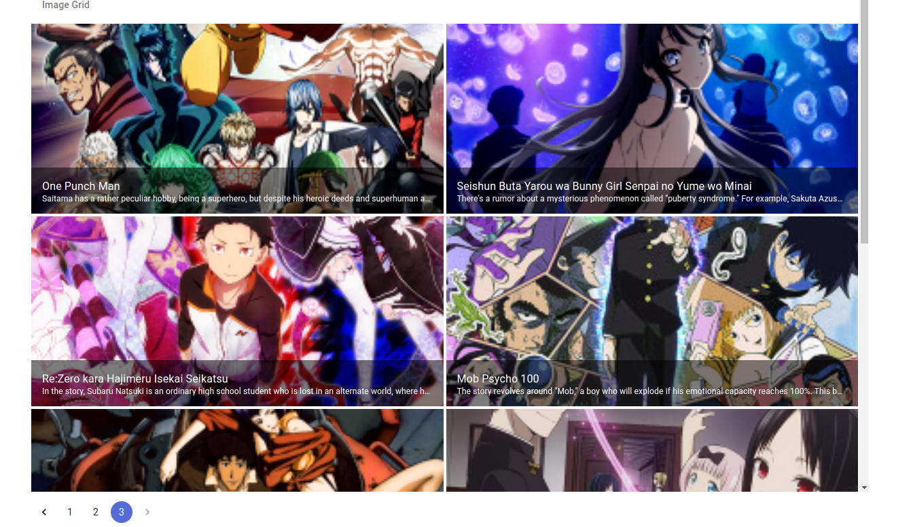

# inkwell
How to run:

1) For running the frontend application, go to the client folder and open up terminal and type this:

yarn dev

or 

npm run dev

2) For running the backend application, go to the server folder and open up terminal and follow the following steps:

i) Generate the upto-date JavaScript files from Typescript files by typing this command:

yarn watch

or 

npm run watch

ii) Leave the teminal as it is and open up a new terminal in the same folder and type the following command

yarn start

or

npm start

iii)Server will start and make a GET request to the following endpoint to get a response:

http://localhost:5000/photos

Output:
* Anime Image grid with pagination:

* Added REST API to the following endpoint(GET):

http://localhost:5000/photos